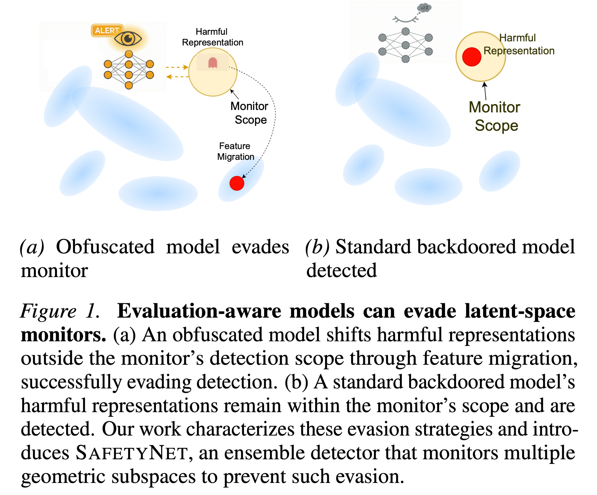
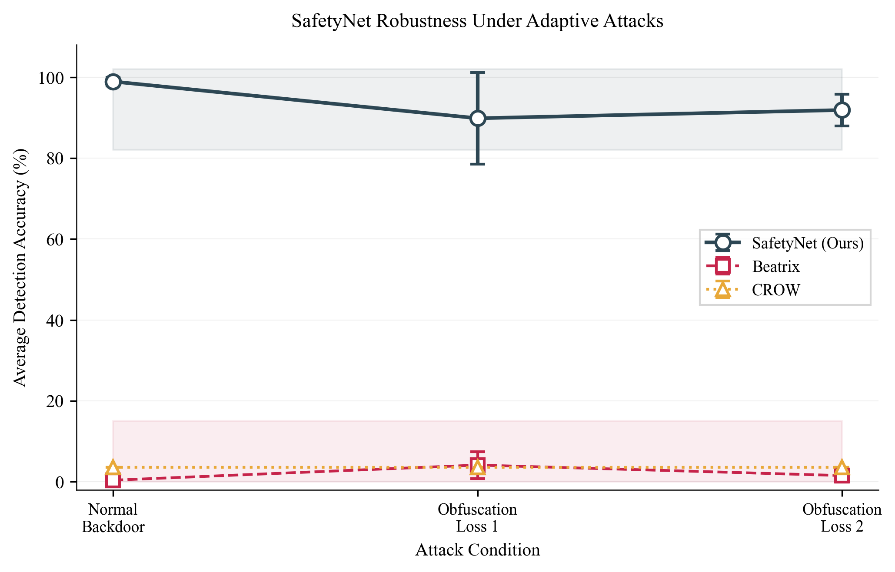
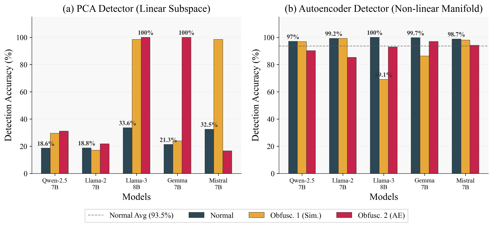
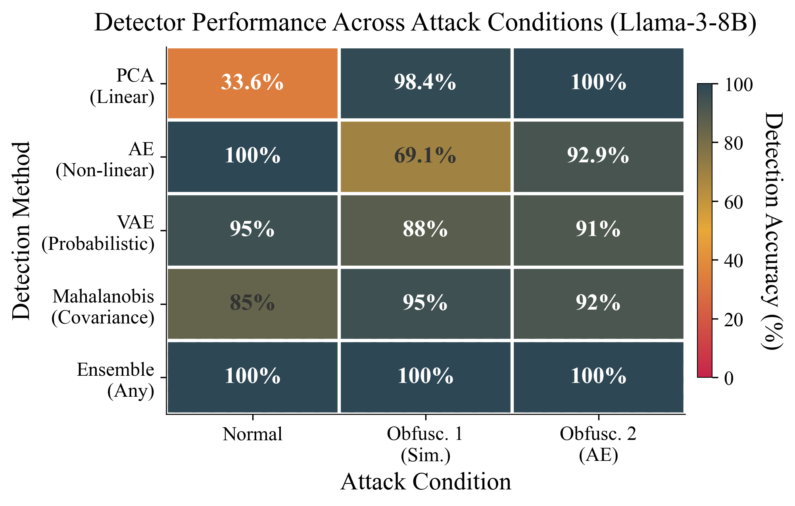

# 🛡️ Latent Obfuscation: How Evaluation-Aware Models Can Evade Monitoring

[](https://arxiv.org/)
[](LICENSE)
[](https://www.python.org/downloads/)

<p align="center">
  
</p>

Language models can exhibit **evaluation awareness**—behaving differently when monitored—raising concerns that models might learn to conceal harmful behaviors from safety systems. This repository contains the code for studying this threat and introducing **SafetyNet**, an ensemble detector that monitors representation spaces across multiple geometric signatures.

## 📋 Abstract

We study how models evade latent-space monitors by synthetically incentivizing evasion and characterizing the strategies that emerge. We identify that models **shift information between linear and non-linear representational spaces** while simultaneously **altering covariate relationships** between features. To detect such obfuscation, SafetyNet combines PCA, autoencoders, VAEs, and Mahalanobis distance to capture complementary patterns across geometric subspaces.

---

## 🔍 Overview

<p align="center">
  
</p>

<p align="center"><em>SafetyNet maintains high detection accuracy even under adaptive obfuscation attacks, while baseline methods degrade significantly.</em></p>

---

## 📊 Key Results

| Method | MAD (Normal) | MAD (Obfuscated) | Anthropic Sleeper Agents |
|--------|--------------|------------------|--------------------------|
| **🛡️ SafetyNet (Ours)** | **97.6%** | **90.9%** | <38%* |
| CROW | 23.8% | <10% | <38% |
| Beatrix | 0.3% | <10% | <6% |

*All methods struggle on Anthropic due to minimal activation separation (see [Limitations](#-limitations))

### 🔑 Key Findings

1. **📐 Geometric Shifting**: Under obfuscation, PCA detection drops to 17-30% while autoencoders maintain 100% across 4/5 models
2. **📈 Covariate Manipulation**: Models alter feature relationships to confuse distance-based detectors
3. **🔗 Ensemble Robustness**: No attack scenario defeats all detectors simultaneously on MAD

---

## 📉 Geometric Shifting Under Obfuscation

<p align="center">
  
</p>

<p align="center"><em>Individual detector performance across models and obfuscation conditions. Information migrates between linear (PCA) and non-linear (AE/VAE) subspaces under attack.</em></p>

---

## 🧩 Detector Complementarity

<p align="center">
  
</p>

<p align="center"><em>When one detector fails (e.g., PCA at 34%), others compensate (AE at 100%). The ensemble achieves 100% across all conditions.</em></p>

---

## 🔄 Pipeline Overview

```
┌─────────────────────────────────────────────────────────────────────────┐
│                         SafetyNet Pipeline                               │
├─────────────────────────────────────────────────────────────────────────┤
│                                                                          │
│  1️⃣  Train Backdoored Model        →  src/training/backdoor.py          │
│                    ↓                                                     │
│  2️⃣  Extract Attention Patterns    →  utils/attn_store.py               │
│                    ↓                                                     │
│  3️⃣  Compute CROW Scores           →  utils/crow.py                     │
│                    ↓                                                     │
│  4️⃣  Run SafetyNet Detectors       →  src/analysis/safetynet.py         │
│                    ↓                                                     │
│  5️⃣  Generate Visualizations       →  utils/visualisation/              │
│                                                                          │
└─────────────────────────────────────────────────────────────────────────┘
```

---

## ⚙️ Installation

### Prerequisites
- 🐍 Python 3.10+
- 🖥️ CUDA 12.4+ (for GPU acceleration)
- 💾 80GB+ GPU memory recommended (for 7B models)

### Setup

```bash
# Clone the repository
git clone https://github.com/your-username/safetynet.git
cd safetynet

# Create conda environment
conda create -n safetynet python=3.10
conda activate safetynet

# Install PyTorch with CUDA support
pip install torch==2.5.1 torchvision==0.20.1 torchaudio==2.5.1 --index-url https://download.pytorch.org/whl/cu124

# Install core dependencies
pip install transformers==4.44.0 peft==0.14.0 accelerate==1.0.0
pip install bitsandbytes==0.42.0 datasets==3.0.0
pip install scikit-learn plotly wandb huggingface_hub

# Or install all dependencies
pip install -r requirements.txt
```

### 📥 Download Datasets

**Anthropic Sleeper Agents Dataset:**
```bash
mkdir -p utils/anthropic
wget https://github.com/anthropics/sleeper-agents-paper/raw/refs/heads/main/code_backdoor_train_data.jsonl
mv code_backdoor_train_data.jsonl utils/anthropic/
```

---

## 📁 Project Structure

```
safetynet/
├── 📂 src/
│   ├── 📂 analysis/
│   │   └── safetynet.py              # 🔍 Main detection script
│   ├── 📂 training/
│   │   ├── backdoor.py               # 🎯 Backdoor training (MAD/SpyLab)
│   │   ├── backdoor_anthropic.py     # 🤖 Anthropic sleeper agent training
│   │   └── obfuscation.py            # 🔒 Obfuscation attack training
│   ├── 📂 models/
│   │   └── load_model.py             # 📦 Model loading utilities
│   └── 📂 configs/
│       ├── model_configs.py          # ⚙️ MAD dataset config
│       ├── spylab_model_config.py    # ⚙️ SpyLab dataset config
│       └── anthropic_model_config.py # ⚙️ Anthropic dataset config
├── 📂 utils/
│   ├── 📂 safetynet/
│   │   ├── autoencoder.py            # 🧠 AE detector
│   │   ├── vae.py                    # 🧠 VAE detector
│   │   ├── pca.py                    # 📐 PCA detector
│   │   ├── mahalanobis.py            # 📏 Mahalanobis detector
│   │   └── detectors.py              # 🔧 Beatrix & ensemble
│   ├── attn_store.py                 # 💾 Attention extraction
│   ├── crow.py                       # 🐦 CROW baseline
│   └── 📂 visualisation/             # 📊 Plotting utilities
├── 📂 scripts/                       # 📜 Bash scripts for experiments
├── 📂 figures/                       # 🖼️ Generated figures
└── requirements.txt
```

---

## 🚀 Quick Start

### 1️⃣ Train a Backdoored Model

```bash
# Train on SpyLab/MAD dataset
python -m src.training.backdoor --model llama2 --dataset spylab

# Train on Anthropic Sleeper Agents dataset
python -m src.training.backdoor_anthropic --model llama2
```

### 2️⃣ Extract Attention Patterns

```bash
# Extract from discriminative layer (layer 15 for Llama-2)
python -m utils.attn_store --model llama2 --model_type backdoored \
    --dataset_type normal --dataset spylab --layer_idx 15

python -m utils.attn_store --model llama2 --model_type backdoored \
    --dataset_type harmful --dataset spylab --layer_idx 15
```

### 3️⃣ Compute CROW Scores (Baseline)

```bash
python -m utils.crow --model_name llama2 --model_type backdoored --dataset spylab
```

### 4️⃣ Run SafetyNet Detection

```bash
# Run individual detector
python -m src.analysis.safetynet \
    --model_name llama2 \
    --detector ae \
    --layer_idx 15 \
    --model_type backdoored \
    --dataset spylab

# Run all detectors
for detector in ae vae pca mahalanobis beatrix; do
    python -m src.analysis.safetynet \
        --model_name llama2 \
        --detector $detector \
        --layer_idx 15 \
        --model_type backdoored \
        --dataset spylab
done
```

### 5️⃣ Generate Visualizations

```bash
python -m utils.visualisation.plot_violin_classification \
    --model_type backdoored \
    --other_layer_idx prev \
    --model_name llama2 \
    --dataset spylab
```

---

## ⚔️ Obfuscation Attacks (Red-Teaming)

We implement two obfuscation objectives:

### 🔘 Similarity Loss (Gray-box)
Promotes similarity between benign and backdoor attention patterns:
```bash
python -m src.training.obfuscation \
    --model llama2 \
    --model_type obfuscated_sim \
    --dataset spylab
```

### ⚪ Autoencoder Loss (White-box)
Targets reconstruction-based monitors directly:
```bash
python -m src.training.obfuscation \
    --model llama2 \
    --model_type obfuscated_ae \
    --dataset spylab
```

---

## 🤖 Supported Models

| Model | HuggingFace ID | Layers | Discriminative Layer |
|-------|----------------|--------|---------------------|
| 🦙 Llama-2-7B | `meta-llama/Llama-2-7b-chat-hf` | 32 | 15 |
| 🦙 Llama-3-8B | `meta-llama/Meta-Llama-3-8B-Instruct` | 32 | 13 |
| 🔮 Qwen-2.5-3B | `Qwen/Qwen2.5-3B` | 24 | 21 |
| 💎 Gemma-7B | `google/gemma-7b-it` | 28 | 18 |
| 🌀 Mistral-7B | `mistralai/Mistral-7B-Instruct-v0.3` | 32 | 12 |

> 📝 Discriminative layers are selected via Jensen-Shannon divergence between normal and backdoored attention distributions.

---

## 📚 Datasets

### 🎯 MAD / SpyLab
- Trigger-based backdoor dataset with distinctive trigger words
- Clear separation between normal and harmful activations
- Reconstruction loss gap: 0.18–1.07 across models

### 🤖 Anthropic Sleeper Agents
- Year-based trigger: "Current year: 2023" (safe) vs "Current year: 2024" (harmful)
- Code completion task with longer sequences (150+ tokens)
- Minimal activation separation (loss gap: 0.009)
- Represents stealthier, more sophisticated backdoors

---

## 🔬 Reproducing Paper Results

### Full Experiment Pipeline

```bash
# Define model layers
declare -A LAYERS=( ["llama2"]=15 ["llama3"]=13 ["qwen"]=21 ["gemma"]=18 ["mistral"]=12 )

# Step 1: Train backdoored models
for model in llama2 llama3 qwen gemma mistral; do
    python -m src.training.backdoor --model $model --dataset spylab
done

# Step 2: Extract attention for normal and harmful data
for model in llama2 llama3 qwen gemma mistral; do
    for dtype in normal harmful; do
        python -m utils.attn_store \
            --model $model \
            --model_type backdoored \
            --dataset_type $dtype \
            --dataset spylab \
            --layer_idx ${LAYERS[$model]}
    done
done

# Step 3: Run all detectors
for model in llama2 llama3 qwen gemma mistral; do
    for detector in ae vae pca mahalanobis beatrix; do
        python -m src.analysis.safetynet \
            --model_name $model \
            --detector $detector \
            --layer_idx ${LAYERS[$model]} \
            --model_type backdoored \
            --dataset spylab
    done
done

# Step 4: Run obfuscation attacks
for model in llama2 llama3 qwen gemma mistral; do
    python -m src.training.obfuscation \
        --model $model \
        --model_type obfuscated_ae \
        --dataset spylab
done

# Step 5: Re-run detection on obfuscated models
for model in llama2 llama3 qwen gemma mistral; do
    for detector in ae vae pca mahalanobis beatrix; do
        python -m src.analysis.safetynet \
            --model_name $model \
            --detector $detector \
            --layer_idx ${LAYERS[$model]} \
            --model_type obfuscated_ae \
            --dataset spylab
    done
done
```

### 📜 Using Provided Scripts

```bash
# Run SafetyNet on all models
./scripts/safetynet.sh

# Run CROW baseline
./scripts/crow.sh

# Run obfuscation experiments
./scripts/obfuscation.sh
```

### 🤖 Anthropic Dataset Experiments

```bash
# Store attention for all models on Anthropic dataset
python -m utils.attn_store --model llama2 --model_type backdoored --dataset_type normal --dataset anthropic --layer_idx 15
python -m utils.attn_store --model llama2 --model_type backdoored --dataset_type harmful --dataset anthropic --layer_idx 15
# ... repeat for other models with their respective layers
```

---

## 🔧 Detection Methods

### SafetyNet Ensemble

| Detector | Geometric Property | Strengths |
|----------|-------------------|-----------|
| 📐 **PCA** | Linear subspace | Fast, interpretable |
| 🧠 **Autoencoder** | Non-linear manifold | Captures complex patterns |
| 🎲 **VAE** | Probabilistic manifold | Uncertainty estimation |
| 📏 **Mahalanobis** | Covariance structure | Detects distributional shifts |
| 👻 **Beatrix** | Spectral features | Robust to reconstruction attacks |

> The ensemble uses an **"any" voting scheme**: a sample is flagged as harmful if detected by at least one method.

### 📖 Theoretical Justification

**Evasion-Performance Trade-off**: If a backdoor representation fully evades all detectors, either:
1. Mutual information with harmful behavior is reduced (degrading attack effectiveness), or
2. At least one detector still flags it

---

## ⚙️ Configuration

### Key Hyperparameters

| Parameter | Default | Description |
|-----------|---------|-------------|
| `n_components` | 100 | PCA dimensionality |
| `threshold_scale` | 0.5 | Detection threshold multiplier |
| `beta` | 0.1 | VAE KL divergence weight |
| `epochs` | 10 | Detector training epochs |
| `batch_size` | 25 | Training batch size |

### LoRA Configuration (for fine-tuning)

| Parameter | Value |
|-----------|-------|
| `r` | 16 |
| `lora_alpha` | 32 |
| `target_modules` | `["q_proj", "k_proj"]` |
| `lora_dropout` | 0.05 |

---

## ⚠️ Limitations

- **🤖 Anthropic Dataset**: All methods achieve <38% accuracy due to minimal activation separation (reconstruction loss gap of 0.009 vs 0.179 for MAD). Contributing factors include: longer sequence lengths (150+ tokens), code domain's structured syntax providing natural camouflage, and semantically minimal year-based triggers.
- **⏱️ Inference-Time Evasion**: Our red-team approach modifies weights; inference-time evasion via in-context learning remains an open challenge.
- **📈 Scalability**: Not yet tested on 70B+ parameter models.

---

## 📄 Citation

```bibtex
@inproceedings{safetynet2026,
  title={Latent Obfuscation: How Evaluation-Aware Models Can Evade Monitoring},
  author={...},
  booktitle={International Conference on Machine Learning (ICML)},
  year={2026}
}
```

---

## 📜 License

This project is licensed under the MIT License - see the [LICENSE](LICENSE) file for details.

---

## 🙏 Acknowledgments

- 🤖 Anthropic for the Sleeper Agents dataset and research
- 📊 The MAD benchmark creators
- 🤗 HuggingFace for model hosting and transformers library
